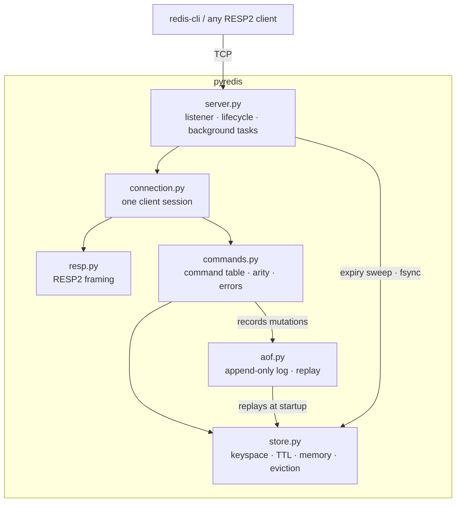

# PyRedis

An in-memory key-value server written from scratch in Python, speaking the Redis
wire protocol over raw TCP.

PyRedis is an educational reimplementation, not a Redis replacement. It supports
eleven commands — enough to be driven by `redis-cli` and other real Redis
clients — and implements the parts of a database server that are interesting to
build by hand: protocol framing, an async network layer, expiration, an
append-only log, and bounded memory with eviction. Everything else about Redis is
deliberately out of scope.

## Features

- **RESP2 over raw TCP** — no HTTP, no web framework, no client library. Real
  clients such as `redis-cli -p 6380` connect and work.
- **asyncio server** — one event loop, one task per connection, no threads and
  no locks anywhere in the command path.
- **Binary-safe end to end** — keys and values are `bytes`. NUL bytes, CRLF, and
  data that is not valid UTF-8 round-trip untouched.
- **TTL expiration** — `EXPIRE`, `TTL`, `PERSIST`, and `SET … EX|PX`, with both
  lazy and bounded active expiration.
- **AOF persistence and recovery** — every mutation appended to a log that is
  replayed at startup, with three fsync policies and repair of a torn tail.
- **Bounded memory** — configurable `maxmemory` with `noeviction` or sampled
  `allkeys-lru` eviction, integrated with persistence so evicted keys stay gone.
- **515 tests**, `ruff` clean, `mypy --strict` clean, zero suppressions.

## Architecture



Layers point strictly downwards. `store.py` imports nothing else in the project
and knows nothing about sockets, protocols, or files; `resp.py` knows only the
wire format; `commands.py` is the only place that knows both a command's meaning
and what should be persisted.

| Module | Responsibility |
| ------ | -------------- |
| `server.py` | Process lifecycle, listener, recovery, expiry sweep, fsync cycle |
| `connection.py` | One client session: read, dispatch, reply, repeat |
| `resp.py` | RESP2 decoding and encoding; the only module that knows the wire format |
| `commands.py` | Command table, arity, error mapping, what each mutation records |
| `store.py` | Data semantics: keyspace, expiration, memory accounting, eviction |
| `aof.py` | The append-only log, its scanner, and replay |
| `config.py` | Typed configuration from `PYREDIS_*` environment variables |
| `log.py` | One stderr log handler, configured once |

## Supported commands

| Command | Reply |
| ------- | ----- |
| `PING [message]` | `+PONG`, or the message as a bulk string |
| `SET key value [EX seconds \| PX milliseconds]` | `+OK` |
| `GET key` | The value, or a null bulk string |
| `DEL key [key ...]` | Integer: keys removed |
| `EXISTS key [key ...]` | Integer: how many exist, counting repeats |
| `INCR key` | Integer: the new value |
| `EXPIRE key seconds` | Integer: `1` if a deadline was set, else `0` |
| `TTL key` | Integer: seconds left, `-1` if no deadline, `-2` if no key |
| `PERSIST key` | Integer: `1` if a deadline was removed, else `0` |
| `DBSIZE` | Integer: number of live keys |
| `FLUSHDB` | `+OK` |

Everything else returns an unknown-command error and leaves the connection
usable.

## Quick start

Requires [uv](https://docs.astral.sh/uv/) and Python 3.12+.

```bash
uv sync
```

```bash
uv run pyredis
```

The server listens on `127.0.0.1:6380` — port 6380 rather than 6379, so it never
collides with a real Redis running locally — until you press Ctrl-C.

Run the guided demo, which starts and stops its own servers and exercises every
feature over a plain TCP socket:

```bash
uv run python scripts/demo.py
```

## Talking to it with redis-cli

```bash
redis-cli -p 6380
```

```text
127.0.0.1:6380> PING
PONG
127.0.0.1:6380> SET name Pyke
OK
127.0.0.1:6380> GET name
"Pyke"
127.0.0.1:6380> INCR visits
(integer) 1
127.0.0.1:6380> SET session token EX 60
OK
127.0.0.1:6380> TTL session
(integer) 60
127.0.0.1:6380> PERSIST session
(integer) 1
127.0.0.1:6380> DBSIZE
(integer) 3
127.0.0.1:6380> FLUSHDB
OK
```

## Configuration

All settings come from `PYREDIS_`-prefixed environment variables. See
[.env.example](.env.example); PyRedis reads the process environment and does not
parse `.env` files itself, so load one with `uv run --env-file .env pyredis`.

| Variable | Default | Meaning |
| -------- | ------- | ------- |
| `PYREDIS_HOST` | `127.0.0.1` | Interface to bind |
| `PYREDIS_PORT` | `6380` | TCP port; `0` asks the OS for a free one |
| `PYREDIS_LOG_LEVEL` | `INFO` | `DEBUG`/`INFO`/`WARNING`/`ERROR`/`CRITICAL` |
| `PYREDIS_AOF_ENABLED` | `false` | Append mutations to a log and replay it at startup |
| `PYREDIS_AOF_PATH` | `pyredis.aof` | Where that log lives |
| `PYREDIS_AOF_FSYNC` | `everysec` | `always` / `everysec` / `no` |
| `PYREDIS_MAXMEMORY` | `0` | Keyspace limit in bytes; `0` is unlimited |
| `PYREDIS_MAXMEMORY_POLICY` | `noeviction` | `noeviction` / `allkeys-lru` |

Sizes are **binary and only binary**: a bare number is bytes, and `kb`/`mb`/`gb`
mean 1024, 1024², and 1024³. The single-letter `1k`/`1m`/`1g` forms are rejected
rather than guessed at, because Redis reads `1k` as 1000 and `1kb` as 1024, and
quietly disagreeing would be worse than refusing.

Exit codes: `0` clean shutdown, `1` the port could not be bound, `2` invalid
configuration, `3` the append-only file could not be read, repaired, or opened.

## Persistence

Off by default. With `PYREDIS_AOF_ENABLED=true`, every mutation is appended to a
log as a RESP2 array — the same framing as the wire protocol, so binary keys and
values need no escaping.

The recorded vocabulary is deliberately a **superset** of the client vocabulary.
Commands whose meaning depends on *when* they ran are rewritten into an absolute
form; everything else is recorded as issued:

| Command | Recorded as |
| ------- | ----------- |
| `SET k v` | `SET k v` |
| `SET k v EX 60` | `SET k v PXAT <absolute ms>` |
| `EXPIRE k 60` | `PEXPIREAT k <absolute ms>` |
| `EXPIRE k 0` (deletes) | `DEL k` |
| `INCR k` | `SET k <resulting value>` |
| eviction | `DEL <victim>` |
| reads, errors, no-ops | nothing |

`PXAT` and `PEXPIREAT` exist only in the file; no client can send them. Because
deadlines are absolute, a key written with `EX 60` comes back with whatever is
left of that minute rather than a fresh one, and a key whose deadline passed
during downtime is simply gone at startup.

**Recovery** happens before the listener binds, so no client sees a half-loaded
keyspace. Replay applies records through lower-level store primitives with
expiration switched off — otherwise a stale deadline applied mid-replay would
delete a key that a later `PERSIST` was about to save — and one sweep afterwards
drops whatever really did expire.

Damaged files are treated differently depending on where the damage is:

| File state | Startup |
| ---------- | ------- |
| Intact | Loads |
| Final record torn by a crash mid-append | **Repaired** — truncated to the last good record, with a warning |
| Corruption anywhere earlier | **Refuses to start**, naming the byte offset |

Every append flushes to the OS regardless of policy, so killing the process
loses nothing; the fsync policy only bounds what a *power* failure can take:

| Policy | Loses at most | Cost |
| ------ | ------------- | ---- |
| `always` | one unacknowledged write | an fsync per write; stalls the event loop |
| `everysec` *(default)* | ~1 second of writes | one blocking fsync per second |
| `no` | whatever the OS has not flushed | none |

If a write to the log fails, the journal enters a **permanent failed state**: the
triggering command is answered `-ERR persistence failure` and is not rolled back,
every later mutation is refused before it touches the store, reads keep working,
and only a restart clears it.

## Expiration

Deadlines are absolute Unix timestamps in integer milliseconds, held separately
from the values. A key expires when the clock reaches its deadline, so at exactly
`now == deadline` it is already gone: `GET` returns nil, `EXISTS` returns `0`,
`TTL` returns `-2`. `TTL` rounds to the nearest second, so a key set with `EX 2`
answers `2` immediately afterwards rather than `1`.

Expiration runs two ways:

- **Lazily** — `GET`, `DEL`, `EXISTS`, `INCR`, `EXPIRE`, `TTL`, `PERSIST`, and
  `DBSIZE` drop an expired key before answering, so no command ever reports a key
  that should be gone.
- **Actively** — a task on the same event loop sweeps every 100 ms, examining at
  most 100 keys carrying a deadline per cycle via a round-robin cursor. It never
  scans the whole keyspace in one tick, and it reclaims keys nobody reads, which
  lazy expiration alone would leak forever.

`DBSIZE` counts only logically live keys, cleaning up as it counts. This
deliberately differs from Redis, which can report a key that every other command
says is gone.

| Rule |
| ---- |
| A plain `SET` on a key with a TTL **clears** the TTL |
| `SET … EX/PX` replaces any existing TTL |
| `INCR` **preserves** the TTL; a failed `INCR` changes neither value nor TTL |
| `DEL` and `FLUSHDB` remove expiration metadata with the key |
| `EXPIRE key 0` or a negative time **deletes the key** and answers `1` |
| `SET k v EX 0` is an **error** — `invalid expire time in 'set' command` |

## Memory limits and eviction

Unlimited by default. `memory_used` is a deterministic accounting model, **not**
process RSS:

```
memory_used = Σ over live keys ( len(key) + len(value) + 64 )
```

The 64 bytes stand in for two dictionary slots and the object headers. Expiration
metadata is outside the model, so a key with a TTL costs exactly what the same key
without one costs — `EXPIRE` never fails for want of memory, and `PERSIST` never
frees any. The total is maintained incrementally, so checking it is never a scan.

The limit is **hard**: after every admitted write, `memory_used <= maxmemory`.
Redis's limit is soft — it evicts before a command and lets that command overshoot
— but a hard ceiling is a stronger, more testable property.

| Policy | A write that would exceed the limit |
| ------ | ----------------------------------- |
| `noeviction` *(default)* | Refused with `-OOM …`, changing nothing |
| `allkeys-lru` | Reclaims expired keys, then evicts least-recently-used keys until it fits |

Only `SET` and `INCR` can be refused; `DEL`, `PERSIST`, `FLUSHDB`, and any
overwrite that shrinks a value are always admitted, and reads never fail.

Recency is a logical counter rather than a clock, so ordering is exact and
eviction is deterministic. `GET`, `SET`, and `INCR` count as use; `EXISTS`, `TTL`,
`DBSIZE`, `EXPIRE`, and `PERSIST` do not — the first three are introspection
(Redis marks them `NOTOUCH` for the same reason) and the last two are metadata
administration, so a TTL-management pass cannot skew eviction.

Choosing a victim samples 5 keys from a round-robin cursor and evicts the least
recently used of them. Expired keys are reclaimed first, so garbage is never kept
in preference to live data, and the key being written is never its own victim.

**Nothing is ever half-evicted.** A write either fits after eviction or is refused
before a single key is removed: the only way eviction can fail is that the entry
would not fit in an empty keyspace, and that is checked up front.

## Testing and quality

```bash
uv run pytest
```

```bash
uv run ruff check .
```

```bash
uv run mypy
```

515 tests: unit tests for the store, protocol, dispatcher, journal, and memory
model, and integration tests that drive a real listener over real sockets —
fragmented and pipelined requests, malformed protocol, concurrent clients,
restart recovery, torn logs, eviction, and SIGINT shutdown of the real process.

Expiration and eviction are tested against an injectable logical clock and a
deterministic sampling cursor, so no test sleeps waiting for a deadline and none
is flaky. `mypy --strict` covers `src`, `tests`, and `scripts`. The project
carries **zero lint suppressions and zero `type: ignore`**.

## Design decisions

**Bytes end to end.** Keys and values are never decoded. RESP has no declared
encoding, so decoding to `str` would mean guessing — and a client sending binary
would crash the protocol layer. It also means key identity is byte identity: two
byte strings that normalise to the same text stay two different keys.

**`KeyValueStore` owns data semantics; nothing else does.** `INCR`'s 64-bit rules,
expiry, and the memory model all live with the data. The dispatcher owns arity and
replies; the protocol layer owns framing. `store.py` imports nothing from the rest
of the project.

**`KeyValueStore` performs no filesystem I/O.** Eviction records its victims in a
buffer that the command layer drains and writes to the log, so persistence never
reaches into the data layer and the store stays testable with no filesystem.

**One event loop, no locks.** Store methods are synchronous and never `await`, so
each command runs to completion without interleaving — atomicity for free. The
expiry sweep and the fsync cycle are ordinary tasks on the same loop and can only
run between commands. This is an invariant, not a mechanism: adding an `await`
inside a store method, or a thread, would silently break it.

**Persistence records facts, not computations.** `INCR` is logged as the value it
produced rather than as an increment, and relative expiry becomes an absolute
deadline. Every record is therefore a statement about the world rather than an
instruction to recompute, which is what makes replay total — no record can fail on
the data — and what stops a restart from resetting a TTL.

**Memory accounting is modelled, not measured.** A fixed per-entry constant plus
payload bytes, rather than `sys.getsizeof`, whose dict-capacity jumps differ by
platform and Python version and would make every boundary approximate. The
docstrings say plainly that this is not RSS.

**Errors never leak internals.** Client-supplied bytes in error text are escaped
and CR/LF stripped, so a command name cannot inject a counterfeit reply frame, and
an unexpected exception is logged server-side and answered with a generic error.

## Limitations

Known, deliberate, and worth stating plainly:

- **No AOF rewrite or compaction.** The log grows without bound, so `maxmemory`
  bounds memory, not disk, and an `INCR`-heavy workload reloads slowly.
- Replay reads the whole log into memory; there is no streaming.
- **Memory accounting is a model, not RSS.** It does not measure the allocator.
- Deadlines are wall-clock, so a system time jump moves every expiration with it.
- `always` fsync stalls the event loop; that is the price of the strongest policy
  without threads.
- No SIGTERM handler — Ctrl-C (SIGINT) shuts down cleanly, `kill` does not.
- A retried `INCR` after a crash between fsync and reply can double-count.
- One implicit database; no `SELECT`.

## Scope and non-goals

PyRedis implements eleven commands. It is **not** Redis-compatible in general, and
the following are deliberately not implemented rather than merely missing:

RESP3 and `HELLO`, inline (telnet-style) commands, `AUTH`/ACLs, `SELECT` and
multiple databases, `COMMAND`/`INFO`/`CONFIG`/`MEMORY USAGE`, transactions and
`MULTI`/`EXEC`, Pub/Sub, Streams, Lua scripting, replication, Sentinel,
clustering, RDB snapshots, LFU and `volatile-*` eviction policies, and every Redis
data type beyond scalar byte values — no lists, hashes, sets, or sorted sets.

Unsupported commands return an error and leave the connection usable, which is why
an interactive `redis-cli` session works: it sends `COMMAND DOCS` on connect, gets
an error, and carries on.
